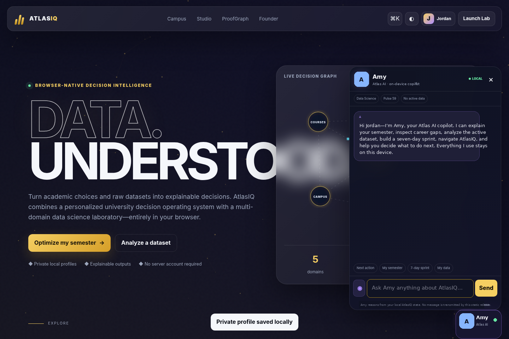

# AtlasIQ — Data, Understood



AtlasIQ is a privacy-first decision intelligence platform created by **Niveditha Mallojhala**, a Data Science student at Purdue University.

It combines two connected products:

1. **AtlasIQ Campus** — a university decision operating system for semester planning, workload modeling, career readiness, evidence building, decision calibration, and campus mobility.
2. **AtlasIQ Studio** — a multi-domain, browser-native data science laboratory for healthcare, finance, sports, climate, education, and arbitrary CSV files.

The static release is designed for GitHub Pages and requires no backend, account server, API key, package manager, or build step.

## What makes this release different

AtlasIQ is no longer tailored to one person. Any visitor can create one or more private local profiles. Each profile gets isolated:

- course plans and A/B/C semester scenarios
- workload preferences
- career skills and target roles
- ProofGraph evidence
- Opportunity Radar analyses
- Decision Memory entries and reviewed outcomes
- custom courses and campus places
- saved datasets in IndexedDB
- Atlas Pulse, Mission Sprint, and Amy conversation history

The founder section remains credited to Niveditha, while the working product adapts to the active visitor.

## Amy — Atlas AI

**Amy** is AtlasIQ’s context-aware, on-device decision copilot. In this static version, she reasons from the user’s local AtlasIQ state rather than pretending to call a cloud LLM.

Amy can:

- explain the current semester score and workload tradeoffs
- identify the highest-impact next action
- interpret career readiness and saved internship analyses
- summarize the active dataset and current AutoML result
- explain ProofGraph coverage and Decision Memory calibration
- build and read a seven-day Mission Sprint
- navigate directly to the right AtlasIQ tool
- explain privacy and local storage behavior
- accept voice input in browsers that support the Web Speech API

No Amy message is transmitted by this GitHub Pages release.

## AtlasIQ Campus

- Private multi-profile workspaces stored on the device
- Generic university mode plus a dedicated Purdue Campus Pack
- Custom course builder for any university
- Semester Simulator with live, explainable workload scoring
- Saved A/B/C semester scenarios
- **Ripple Engine** counterfactual decision graph with uncertainty ranges
- Career Intelligence for six technical internship tracks
- **Opportunity Radar** that extracts job-posting signals and measures skill/evidence coverage
- **Decision Memory** that compares predictions with real outcomes and computes personal calibration
- **ProofGraph** that connects skills to concrete projects, metrics, experiences, and artifacts
- **Atlas Pulse**, a transparent cross-workspace momentum score
- **Seven-Day Mission Sprint**, generated from the user’s weakest current signals
- Campus transition modeling with weather and crowd adjustments
- Custom campus builder and Google Maps handoff
- **Atlas Passport** standalone portfolio snapshot and full local backup export

## AtlasIQ Studio

- Drag-and-drop CSV upload with local browser processing
- Five generated domains: healthcare, finance, sports, climate, and education
- Automated schema and type detection
- Data-quality score, missing-value analysis, and IQR outlier flags
- Pearson correlation discovery and heatmap
- Scatter, line, bar, and histogram visualizations
- Time-window analysis for ordered or temporal data
- Browser-native AutoML arena
  - Regression: mean baseline, linear regression, elastic-net approximation, k-NN regression, decision stump
  - Classification: majority baseline, k-NN classifier, Gaussian Naive Bayes, decision stump
- Holdout evaluation and feature-influence explanations
- What-if sensitivity simulator
- Local conversational dataset analyst
- Profile-scoped **Data Vault** using IndexedDB
- JSON analysis report and chart exports

## Privacy model

- Profiles and app state use `localStorage` and are scoped by profile ID.
- Saved dataset rows use IndexedDB and are scoped by profile ID.
- Uploaded CSV files are analyzed in the browser.
- The static release does not transmit personal data, datasets, or Amy messages.
- Visitors can export a full JSON backup, import it as a new profile, or delete an active profile and its local data.
- External links such as Google Maps leave AtlasIQ only when the visitor explicitly opens them.

Academic, career, campus, healthcare, and model outputs are educational decision aids—not guarantees, diagnoses, official advising, or production model validation.

## Run locally

Opening `index.html` directly works for most features. For the service worker, installation behavior, and the most reliable IndexedDB experience, run a local server:

```bash
python3 -m http.server 8000
```

Then open `http://localhost:8000`.

## Deploy to GitHub Pages

1. Create a repository such as `atlasiq`.
2. Upload the **contents** of this folder so `index.html` is at the repository root.
3. Open **Settings → Pages**.
4. Select **Deploy from a branch**.
5. Choose `main` and `/ (root)`.
6. Save and open the Pages URL after deployment finishes.

All runtime paths are relative, and `.nojekyll` is included.

## Repository structure

```text
atlasiq/
├── index.html
├── styles.css
├── app.js
├── enhancements.js
├── manifest.webmanifest
├── sw.js
├── .nojekyll
├── assets/
│   └── favicon.svg
├── AtlasIQ_Single_File.html
├── README.md
├── DEMO_GUIDE.md
└── LICENSE
```

## Suggested recruiter demo

1. Create a new profile for a non-Purdue university to demonstrate product generalization.
2. Compare two semester scenarios and open Ripple Engine.
3. Paste a real internship posting into Opportunity Radar.
4. Add a quantified ProofGraph entry.
5. Log a decision and record an outcome.
6. Ask Amy what to do next.
7. Load a Studio dataset, run AutoML, and ask Amy to explain it.
8. Save the dataset to the local vault and export an Atlas Passport.

## Production roadmap

A future full-stack edition can preserve this interface while adding:

- authenticated cross-device accounts and encrypted cloud sync
- Python/FastAPI analytical services
- PostgreSQL and object storage
- authorized university catalog and schedule integrations
- cross-validated XGBoost, LightGBM, CatBoost, and time-series pipelines
- SHAP explanations, experiment tracking, and a model registry
- secure server-side LLM tools for Amy
- validated workload models, accessibility review, and user studies

Never place private API keys in GitHub Pages JavaScript.

## Founder

**Niveditha Mallojhala**  
B.S. Data Science, Purdue University — Expected May 2029  
Email: niveditha.mallojhala@gmail.com
